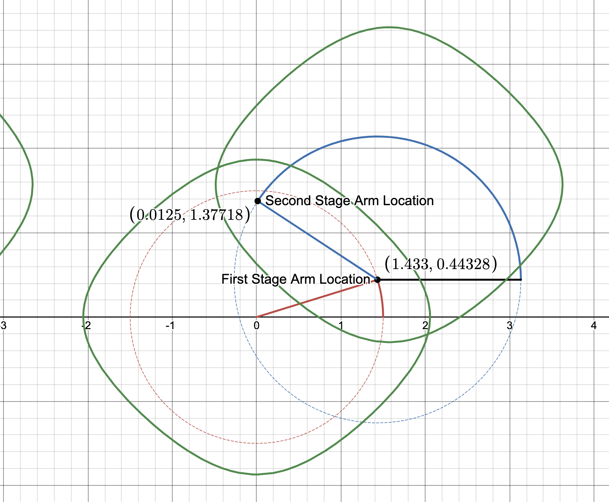
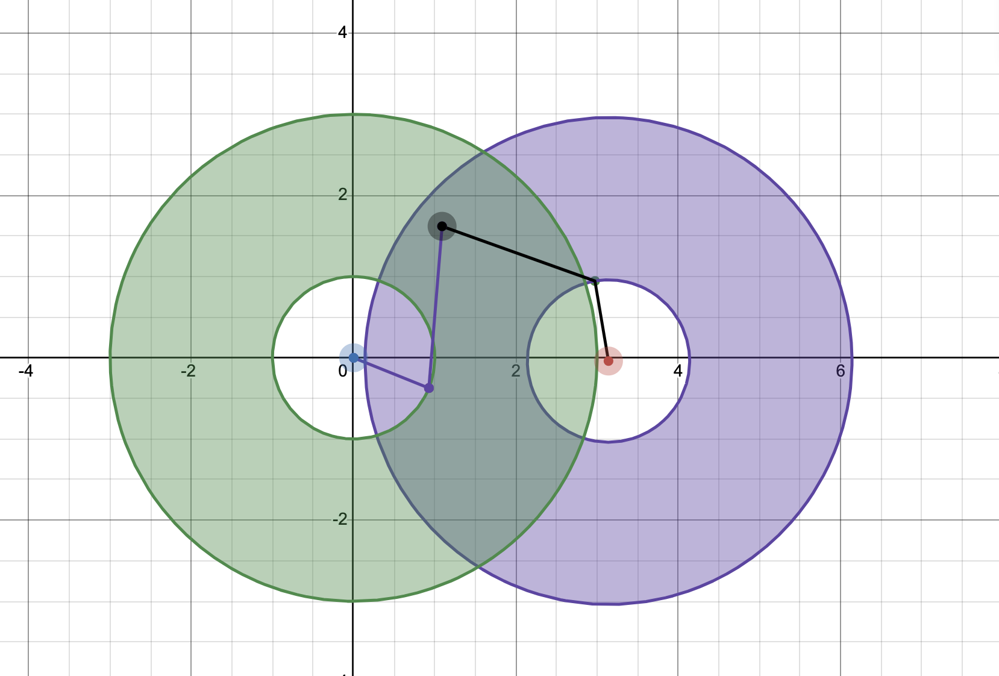

# Arm Sims

I created many arm simulations for people to make sure that their robots are working as they want to
There are 3 main different simulations that you can use for this project. 

1. You can use the Geometric Inverse Kinematics Simulation to test the base line useage of inverse kinematics in a function
2. You can also try to have PID incorporated into the functions
3. There are also Simulations for spirographs that you can use for the project.

# Getting Started

Please use the build configurator in our download page to configure and download an LWJGL release. 
You will also need a Java SE Development Kit (JDK), LWJGL requires version 8 or higher. Then proceed by setting up a project in your favorite IDE and configuring it as described in the Installation Guide.

You can change the file that you want to use for the simulations by going to -> Scene -> scene(variable) -> then changing the variable the Scene that you want. 

Maven builds projects based on an XML file named pom.xml (Project Object Model) which manages project dependencies (the libraries you need to use) and the steps to be performed during the build process. 

Then build the project and you are good!

